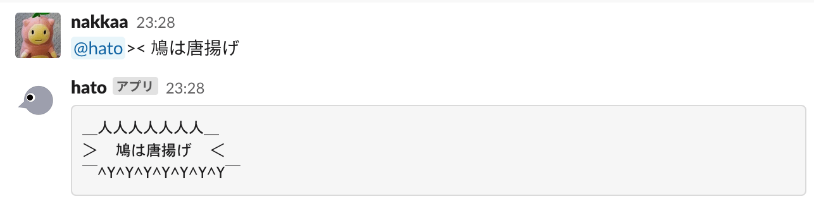

# 鳩bot - 愛嬌のあるBot


鳩botでは主に次のことができます。

- 雨雲情報 ... `amesh [text]` で指定した地名・住所[text]の雨雲情報を画像で表示します。
- 最新の地震情報 ... `eq` で最新の地震情報を3件表示します。
- パワーワードの登録、表示 ... `text` で登録したパワーワードを表示します。
- 突然の死吹き出しで整形 ... `>< [text]` で文字列[text]を「突然の死」吹き出しで整形します。



## 鳩botを動かす

鳩botは自分のPC上で動かすことができます。

### 必要なもの

鳩botを使うには以下が必要です。

- Dockerが動作するPC
- Slack API Token ([Slack API Tokenの取得手順](./doc/01_Get_Slack_API_Token.md)) (Slackで動かす場合のみ)
- Discord Bot Token ([Discord Bot Tokenの取得手順](./doc/03_Get_Discord_Bot_Token.md)) (Discordで動かす場合のみ)
- Misskeyアクセストークン ([Misskeyアクセストークンの取得手順](./doc/04_Get_Misskey_Access_Token.md)) (Misskeyで動かす場合のみ)
- Yahoo API Token ([Yahoo API Tokenの取得手順](./doc/05_Get_Yahoo_API_Token.md))
- OpenAI API Key ([OpenAI API Keyの取得手順](./doc/06_Get_OpenAI_API_Token.md))

### fly.io上で動かす

1. 事前にSlack API TokenとYahoo API Tokenを取得します。
2. [Launch a demo app · Fly Docs](https://fly.io/docs/getting-started/launch-demo/#1-install-flyctl)に記載されている手順で `fly` コマンドをインストールします。
3. [Sign up / Sign in · Fly Docs](https://fly.io/docs/getting-started/launch-demo/)に記載されている手順でfly.ioへの登録・ログインを行います。
4. [Dashboard · Fly](https://fly.io/dashboard/)内の `Billing` からクレジットカードを登録します (無料枠で使用する場合も必須)。
5. [`yq` コマンドのGitHub](https://github.com/mikefarah/yq/?tab=readme-ov-file#install)に記載されている手順で `yq` コマンドをインストールします。
6. このリポジトリをcloneします。

   安定版を使う場合は `-b master` を指定します。最新の開発版を使う場合は指定不要です。

    ```sh
    git clone -b master https://github.com/dev-hato/hato-bot.git
    cd hato-bot
    ```
7. `.env` ファイルを作成し  Slack API Token、PostgreSQLの認証情報、Yahoo API Tokenなどを記述します。

   `.env.example` をコピーして使うとよいでしょう。

   MODEに `discord` を指定すると、DiscordのBotとして動作します。

   MODEに `misskey` を指定すると、自分のいるサーバーからのメンションに限って反応するMisskeyのBotとして動作します。
8. `fly.toml` ファイルを作成します。

   `fly.template.toml` をコピーし、TODOコメントに従って編集すると良いでしょう。
9. 次のコマンドを実行してfly.ioへのデプロイを行います。
    ```sh
    ./flyio_deploy.sh
    ```

### 自分のPC上で動かす

自分のPCで動かすこともできます。

1. 事前にSlack API TokenとYahoo API Tokenを取得します。
2. hadolintをインストールします。

3. このリポジトリをcloneします。

    安定版を使う場合は `-b master` を指定します。最新の開発版を使う場合は指定不要です。

    ```sh
    git clone -b master https://github.com/dev-hato/hato-bot.git
    cd hato-bot
    ```

    または [Release](https://github.com/dev-hato/hato-bot/releases/latest) から最新の安定版をダウンロードして解凍します。

4. 必要に応じてパッケージをインストールします。

    ```sh
    pipenv install
    npm install
    ```

5. `.env` ファイルを作成し  Slack API Token、PostgreSQLの認証情報、Yahoo API Tokenなどを記述します。

    `.env.example` をコピーして使うとよいでしょう

    MODEに `discord` を指定すると、DiscordのBotとして動作します。

    MODEに `misskey` を指定すると、自分のいるサーバーからのメンションに限って反応するMisskeyのBotとして動作します。

6. docker composeで鳩botとPostgreSQLを起動します。

    ```sh
    export TAG_NAME=$(git symbolic-ref --short HEAD | sed -e "s:/:-:g")
    docker compose up -d --wait
    ```

    開発時は代わりに次のコマンドを実行します。

    ```sh
    export TAG_NAME=$(git symbolic-ref --short HEAD | sed -e "s:/:-:g")
    docker compose -f docker-compose.yml -f dev.base.docker-compose.yml -f dev.docker-compose.yml build
    docker compose -f docker-compose.yml -f dev.base.docker-compose.yml -f dev.docker-compose.yml watch
    ```

7. コードの変更はdocker composeの再起動で適用できます。

    ```sh
    export TAG_NAME=$(git symbolic-ref --short HEAD | sed -e "s:/:-:g")
    docker compose restart
    ```

   開発時は自動的にDockerイメージの再ビルドが行われ反映されます。

#### lintをかける方法

```sh
npm run lint
```

#### コマンドの実行方法

- 鳩botに対しコマンドを実行したいときは `post_command.py` を使うと便利です。

    ```sh
    pipenv run python post_command.py --channel {投稿先のチャンネルのchannel id} \
                                      --user {自分のuser_id} \
                                      "{hato-botのコマンド}"
    ```

- または[ngrok](https://ngrok.com/)を使うこともできます。

    ```sh
    ./ngrok http 3000
    ```

#### コミットする前に行うこと

開発に必要なパッケージと `pre-commit` のインストールを行います。

```sh
pipenv install --dev
pipenv run pre-commit install
```

#### 補足

- コードを整形する場合は `pipenv run autopep8 --in-place --recursive .` を実行します。

## 鳩botコマンド一覧

- 鳩botで使用可能なコマンドは次の通りです。

    ```text
    {commands}
    ```

## バージョンアップによる変更点

- バージョンアップによる変更点については[CHANGELOG](./CHANGELOG.md) を参照してください。

## バグ報告や機能の要望について

- バグ報告や機能追加の要望がある場合は [Issues](https://github.com/dev-hato/hato-bot/issues) の
     `New Issue` から報告をお願いします。

- プルリクエストも大歓迎です。

## クレジット

Botで利用しているサービスのクレジットを記載します。

- [Web Services by Yahoo! JAPAN](https://developer.yahoo.co.jp/sitemap/)
